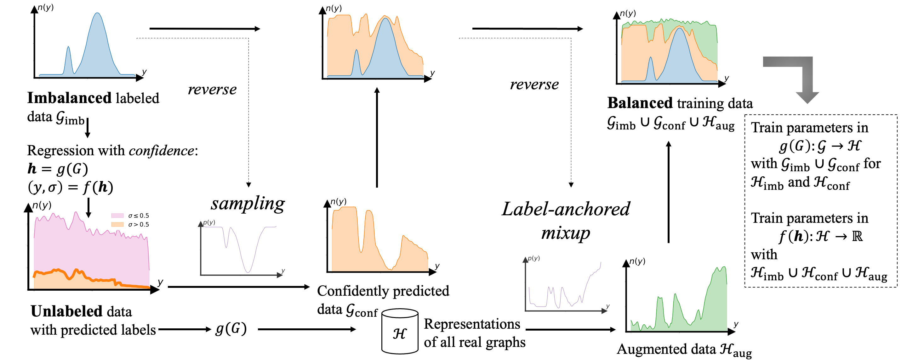

# Semi-Supervised Graph Imbalanced Regression

This is the code for SGIR, a semi-supervised framework for Graph Imbalanced Regression.

> Data imbalance is easily found in annotated data when the observations of certain continuous label values are difficult to collect for regression tasks. When they come to molecule and polymer property predictions, the annotated graph datasets are often small because labeling them requires expensive equipment and effort. To address the lack of examples of rare label values in graph regression tasks, we propose a semi-supervised framework to progressively balance training data and reduce model bias via self-training. The training data balance is achieved by (1) pseudo-labeling more graphs for under-represented labels with a novel regression confidence measurement and (2) augmenting graph examples in latent space for remaining rare labels after data balancing with pseudo-labels. The former is to identify quality examples from unlabeled data whose labels are confidently predicted and sample a subset of them with a reverse distribution from the imbalanced annotated data. The latter collaborates with the former to target a perfect balance using a novel label-anchored mixup algorithm. We perform experiments in seven regression tasks on graph datasets. Results demonstrate that the proposed framework significantly reduces the error of predicted graph properties, especially in under-represented label areas.

Details of the framework can be found in our paper: https://arxiv.org/abs/2305.12087, which has been accepted by KDD 2023.



## Requirements

This code was developed and tested with Python 3.9.13, PyTorch 1.10.1, and PyG 2.0.3.
All dependencies are specified in the `requirements.txt` file.

## Usage

Following is an example command to run experiments on molecular and polymer imbalanced regression tasks, e.g., `ogbg-mollipo`.

```
python main.py --dataset ogbg-mollipo
```

The dataset name can be any of `[ogbg-mollipo, ogbg-molesol, ogbg-molfreesolv, 'plym-density', 'plym-oxygen', 'plym-melting']`. We note that we follow the "Open Graph Benchmark" to implement the three molecular regression tasks. But we split the datasets to characterize imbalanced training distributions and balanced test distributions. Details can be found in the paper or in the function: `dataset/data_utils.py/make_balanced_testset`. The cached index for splitting can be found in `/raw_data/'dataset'/split/balance`

## Citation

If you find this repository useful, please cite our paper:

```
@inproceedings{liu2023semi,
title={Semi-Supervised Graph Imbalanced Regression},
author={Liu, Gang and Zhao, Tong and Inae, Eric and Luo, Tengfei and Jiang, Meng},
booktitle={29th SIGKDD Conference on Knowledge Discovery and Data Mining},
year={2023}
}

```
